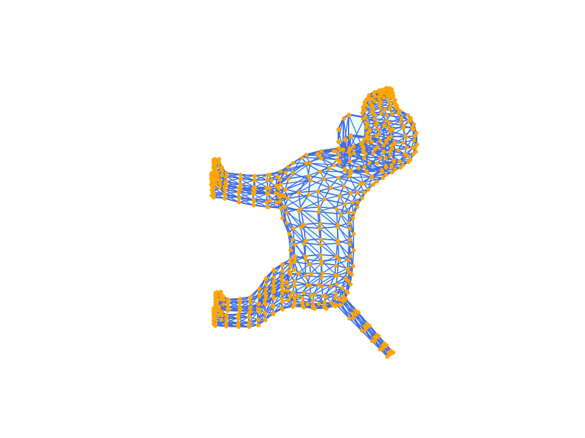
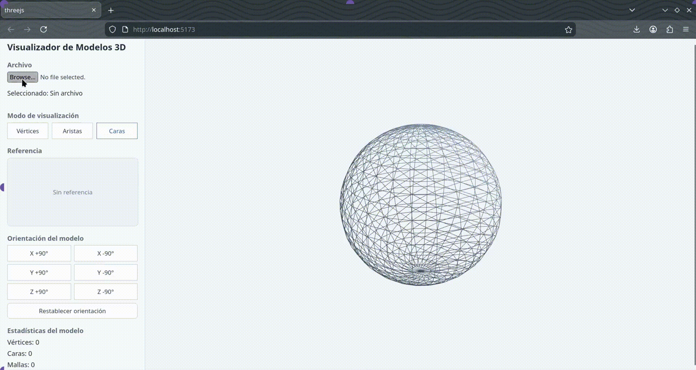

# Taller 1 - Construyendo el Mundo 3D: Vértices, Aristas y Caras

## Nombre del estudiante

Juan David Buitrago Salazar

## Fecha de entrega

`2026-02-20`

---

## Descripción breve

Este taller se enfocó en construir una herramienta de exploración de geometría 3D, trabajando tanto desde un entorno de análisis (Python/Jupyter) como desde un entorno de visualización web interactiva (Three.js con React Three Fiber).

En Python se desarrolló un notebook para cargar modelos 3D en formatos comunes (.OBJ, .STL, .GLTF), analizar su estructura (vértices/aristas/caras) y visualizarlos de forma interactiva. En Three.js se construyó una aplicación web con Vite + React Three Fiber para cargar y renderizar modelos con controles de cámara, modos de visualización (vértices/aristas/caras) e información básica del modelo.

---

## Implementaciones

### Python

Se implementó un Jupyter Notebook orientado a:

- Carga robusta de modelos 3D en formatos `.OBJ`, `.STL` y `.GLTF`.
- Inspección visual separando componentes geométricos: vértices, aristas y caras con colores diferenciados.
- Análisis estructural (métricas del modelo) y visualización de dichas métricas (gráfico/tabla).

Tecnologías principales: `trimesh`, `vedo`, `numpy`, `matplotlib`.

### Three.js / React Three Fiber

Se construyó una app web con Vite + React + React Three Fiber que:

- Carga modelos `.OBJ`, `.STL`, `.GLTF` y `.GLB` usando loaders de Three.js (`OBJLoader`, `STLLoader`, `GLTFLoader`).
- Permite navegación con `OrbitControls` (de `@react-three/drei`).
- Implementa modos de visualización para resaltar vértices, aristas o caras (por ejemplo, material en `wireframe`).
- Incluye una interfaz simple para alternar modos y mostrar estadísticas básicas del modelo (vértices y caras).

---

## Resultados visuales

Evidencias (GIFs/capturas) generadas durante el desarrollo. Los archivos se encuentran en la carpeta `media/`.

### Python - Implementación


Visualización interactiva en el notebook mostrando la malla y el cambio entre componentes geométricos (caras/aristas/vértices) usando `vedo`.



Animación exportada automáticamente desde el notebook: rotación del modelo alrededor del eje Y, renderizando simultáneamente caras, aristas y vértices.

### Three.js - Implementación


Demostración del visor web: carga del modelo, navegación con `OrbitControls` y alternancia entre modos de visualización (vértices/aristas/caras).



Captura representativa del visor mostrando la interfaz (selección de archivo, modos y estadísticas) y el modelo renderizado en el canvas.

---

## Código relevante

Snippets representativos de la lógica principal en cada implementación.

### Ejemplo de código Python:

```python
SUPPORTED_EXTENSIONS = {'.obj', '.stl', '.gltf', '.glb'}

def load_mesh(file_path: str | Path) -> trimesh.Trimesh:
    """Carga OBJ/STL/GLTF/GLB; si viene una escena, concatena geometrías."""
    path = Path(file_path)
    ext = path.suffix.lower()

    if ext not in SUPPORTED_EXTENSIONS:
        raise ValueError(f'Formato no soportado: {ext}')

    loaded = trimesh.load(path, force='scene') if ext in {'.gltf', '.glb'} else trimesh.load(path)

    if isinstance(loaded, trimesh.Scene):
        meshes = [g for g in loaded.geometry.values() if isinstance(g, trimesh.Trimesh)]
        mesh = trimesh.util.concatenate(meshes)
    else:
        mesh = loaded

    return mesh
```

Este fragmento corresponde a la función de carga del notebook: valida extensión, soporta `Scene` (común en GLTF/GLB) y unifica geometrías en una sola malla para que el análisis (vértices/aristas/caras) sea consistente.

### Ejemplo de código Three.js:

```javascript
import { OBJLoader } from 'three/examples/jsm/loaders/OBJLoader.js'
import { STLLoader } from 'three/examples/jsm/loaders/STLLoader.js'
import { GLTFLoader } from 'three/examples/jsm/loaders/GLTFLoader.js'

async function parseModelFile(file) {
  const extension = file.name.split('.').pop().toLowerCase()

  if (extension === 'obj') {
    const content = await file.text()
    return new OBJLoader().parse(content)
  }

  if (extension === 'stl') {
    const buffer = await file.arrayBuffer()
    return new STLLoader().parse(buffer)
  }

  const buffer = await file.arrayBuffer()
  return await new Promise((resolve, reject) => {
    new GLTFLoader().parse(buffer, '', (gltf) => resolve(gltf.scene), reject)
  })
}
```

Este fragmento resume la lógica de carga en el navegador por extensión: se usa `OBJLoader`, `STLLoader` y `GLTFLoader` para convertir el archivo en una escena/objeto renderizable en React Three Fiber. Sobre ese objeto, el visor permite alternar modos: “caras” (malla sólida), “aristas” (material con `wireframe`) y “vértices” (render con `points`).

---

## Cómo ejecutar

### Python (Notebook)

- Abrir el notebook en `python/mesh_explorer_3d.ipynb`.
- Instalar dependencias (si no están instaladas). El notebook incluye una celda de instalación, pero también puede instalarse manualmente:

```bash
pip install numpy trimesh vtk vedo matplotlib ipython imageio imageio-ffmpeg
```

Notas:
- En el notebook, `VIEW_MODE = 'inline'` renderiza embebido; `VIEW_MODE = 'window'` intenta abrir una ventana VTK (requiere entorno gráfico con `DISPLAY`).
- La animación de rotación se exporta a `media/python_mesh_rotation.gif` al ejecutar la celda principal.

### Three.js (Vite + React)

Desde la carpeta `threejs/`:

```bash
npm install
npm run dev
```

---

## Prompts utilizados

Prompts utilizados durante el desarrollo:

### Python

```
Tu tarea es desarrollar un Jupyter Notebook completo y bien estructurado para la carga, análisis y visualización interactiva de modelos 3D. El notebook debe ser funcional como herramienta de exploración de geometría 3D, por lo que necesita manejar correctamente los tres formatos de entrada más comunes en pipelines de gráficos y manufactura: .OBJ, .STL y .GLTF. Para esto, harás uso de las bibliotecas trimesh, vedo, numpy y matplotlib, aprovechando las fortalezas de cada una: trimesh para la carga y análisis de mallas, vedo para visualizaciones 3D interactivas de alta calidad, y numpy junto con matplotlib para cálculos numéricos y visualizaciones estadísticas o informativas adicionales.
En cuanto a la visualización principal de la malla, esta debe distinguir visualmente los tres componentes geométricos fundamentales de cualquier modelo poligonal: los vértices, las aristas y las caras. Cada uno debe renderizarse con un color claramente diferenciado para facilitar la inspección visual de la estructura del modelo. Junto a esta visualización, el notebook debe incluir una sección dedicada al análisis estructural que muestre métricas clave del modelo cargado, como el número total de vértices, aristas y caras, idealmente acompañadas de una representación visual —como un gráfico de barras o una tabla— que permita comparar o contextualizar estos valores de forma inmediata.

En cuanto a la calidad del código, es fundamental que todo el desarrollo siga buenas prácticas de ingeniería de software. Organiza el notebook en celdas con responsabilidades claras y separadas: una para imports y configuración, otra para la carga del modelo, otra para el análisis estructural, y así sucesivamente. Extrae la lógica reutilizable en funciones bien nombradas —por ejemplo, load_mesh, render_mesh_components, compute_mesh_stats, animate_rotation— donde el nombre de cada función comunique con claridad su propósito. Evita duplicar lógica; si algo se repite, abstráelo. Añade comentarios breves donde la lógica no sea evidente por sí sola, especialmente en transformaciones geométricas o configuraciones de renderizado. El código resultante debe ser lo suficientemente legible y modular como para que otro desarrollador pueda entenderlo, extenderlo o adaptarlo sin necesidad de explicaciones adicionales.
```

### Three.js

```
Usando Vite y React Three Fiber, crea una aplicación que cargue un modelo 3D en formato .OBJ, .STL o .GLTF mediante @react-three/drei. El modelo debe visualizarse con OrbitControls para permitir la navegación interactiva. Implementa efectos visuales como Wireframe o Edges para resaltar vértices, aristas o caras del modelo. Como funcionalidad adicional, diseña una pequeña interfaz de usuario que permita alternar entre los modos de visualización (vértices, aristas, caras) y muestre información básica del modelo, como la cantidad de vértices y caras.
Asegúrate de escribir código limpio y legible: separa la funcionalidad en componentes reutilizables con responsabilidades claras, usa nombres descriptivos para variables y funciones que expliquen su propósito, y organiza el código en una estructura de carpetas lógica. Evita la repetición de código, mantén las funciones pequeñas y enfocadas, y añade comentarios donde sea necesario para explicar lógica compleja. El código debe ser fácil de entender y mantener por otros desarrolladores.
```

---

## Aprendizajes y dificultades

Este taller ayudó a consolidar un flujo de trabajo completo para inspección de modelos 3D: desde la carga y normalización de formatos (OBJ/STL/GLTF) hasta la visualización enfocada en componentes geométricos y el cálculo de métricas útiles para “sanity checks” de una malla.

También reforzó la diferencia entre “malla” y “escena” (especialmente en GLTF/GLB), la importancia de centrar/normalizar orientación y escala antes de visualizar, y cómo el grafo de escena de Three.js se recorre para extraer geometrías reales y computar estadísticas.

### Aprendizajes

- Manejo de múltiples formatos: OBJ/STL suelen mapearse directo a geometría, mientras que GLTF/GLB frecuentemente se cargan como escena con varias mallas.
- Métricas estructurales como herramienta de verificación: conteo de vértices/aristas/caras y comparación rápida mediante gráfico de barras.
- Visualización por componentes: representar caras, aristas y vértices de forma diferenciada mejora la lectura de topología.
- En web, traversal de nodos `Mesh` y lectura de atributos de `BufferGeometry` (posición/índices) para calcular vértices y caras.

### Dificultades

- Unificación de GLTF/GLB: algunos modelos no llegan como una sola malla sino como `Scene`. Se resolvió concatenando geometrías para el análisis en Python.
- Orientación inicial de STL: se ajustó una rotación base para que el modelo no aparezca “acostado” al cargarlo en el visor web.
- Compatibilidad de visualización en notebook: el modo `window` depende de entorno gráfico; se dejó alternativa `inline` y mensajes de error claros.
- Diferenciar componentes sin perder contexto: en Three.js, al mostrar vértices/aristas se mantuvo una malla base semitransparente para conservar forma global.

### Mejoras futuras

- Agregar opciones de normalización automática (centrado y escalado) configurables por el usuario tanto en notebook como en web.
- Incorporar visualizaciones adicionales (bounding box, ejes, normales) para depuración rápida de modelos.
- Mejorar la estimación de caras para geometrías no indexadas y soportar conteos por sub-malla/material.

---

## Contribuciones grupales

Taller realizado de forma individual.

---

## Estructura del proyecto

```
semana_01_1_construyendo_mundo_3d/
├── python/          # Código Python (si aplica)
├── threejs/         # Código Three.js/React (si aplica)
├── media/           # OBLIGATORIO: Imágenes, videos, GIFs
└── README.md        # Este archivo
```

---

## Referencias

Lista las fuentes, tutoriales, documentación o recursos consultados durante el desarrollo:

### Modelos 3D utilizados

- **Low Poly Dog** — Jéssica Magno (Sketchfab)
  - Archivo en este repo: `python/low_poly_dog/scene.gltf`
  - Fuente: https://skfb.ly/6UnCF (Sketchfab)
  - Licencia: CC BY (atribución requerida). Ver `python/low_poly_dog/license.txt`.

- **Low-Poly Eevee (STL)** — flowalistik (Thingiverse)
  - Archivo en este repo: `threejs/public/eevee_lowpoly_flowalistik.STL`
  - Fuente: https://www.thingiverse.com/thing:2931434
  - Licencia: CC BY-NC-SA (atribución, uso no comercial y share-alike).

- Tutorial de React Three Fiber: https://docs.pmnd.rs/react-three-fiber/
- Trimesh (documentación): https://trimsh.org/
- Vedo (documentación): https://vedo.embl.es/

---

## Checklist de entrega

- [x] Carpeta con nombre `semana_01_1_construyendo_mundo_3d`
- [x] Código limpio y funcional en carpetas por entorno
- [x] GIFs/imágenes incluidos con nombres descriptivos en carpeta `media/`
- [x] README completo con todas las secciones requeridas
- [x] Mínimo 2 capturas/GIFs por implementación
- [x] Commits descriptivos en inglés
- [x] Repositorio organizado y público

---
