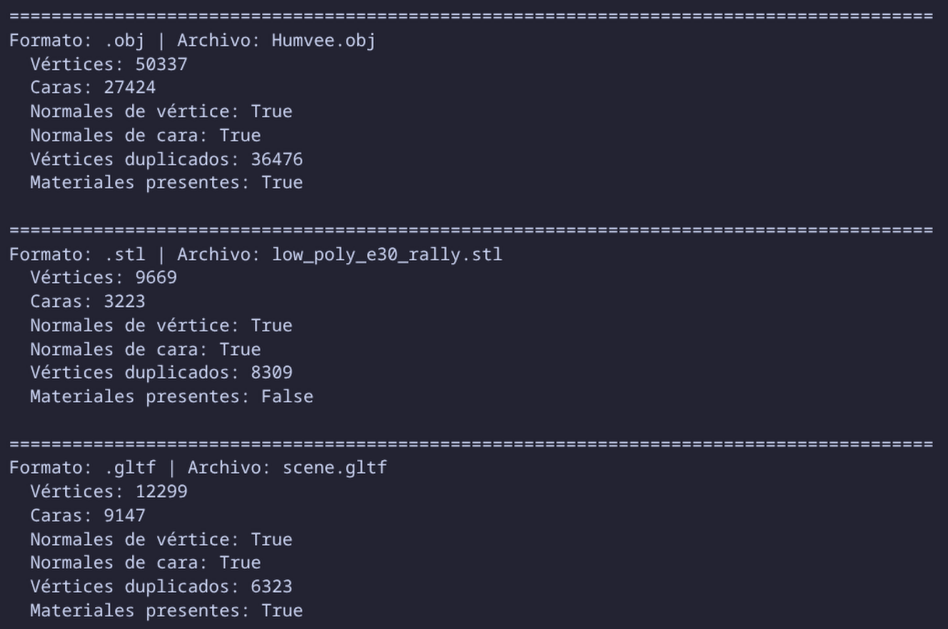
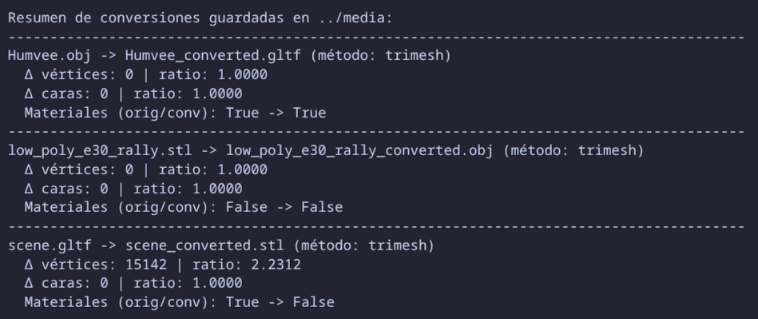
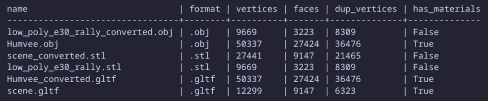

# Taller 2 - Importando el Mundo: Visualización y Conversión de Formatos 3D

## Nombre del estudiante

Juan David Buitrago Salazar

## Fecha de entrega

`2026-02-21`

---

## Descripción breve

Se desarrolló un flujo completo de análisis y comparación de formatos 3D en dos entornos:

- **Python (Jupyter Notebook):** carga de modelos `.OBJ`, `.STL` y `.GLTF`, cálculo de métricas estructurales, detección de duplicados, visualización de componentes geométricos y conversión entre formatos.
- **Three.js + React Three Fiber:** visualización interactiva de los modelos convertidos, cambio de formato activo, controles de cámara y panel con estadísticas en tiempo real.

La intención del taller fue evidenciar diferencias técnicas y visuales entre formatos (estructura de archivo, materiales, manejo de geometría y tamaño de almacenamiento) y validar compatibilidad entre entornos.

---

## Implementaciones

### Python (Jupyter Notebook)

- Notebook: `python/Taller_Importando_el_Mundo_Visualizacion_y_Conversion_de_Formatos_3D.ipynb`.
- Librerías usadas: `trimesh`, `open3d`, `numpy`, `pyassimp` (con fallback a `trimesh` cuando no está disponible).
- Flujo implementado:
  - Carga de modelos `.obj`, `.stl`, `.gltf` desde `../media`.
  - Cálculo de métricas estructurales: vértices, caras, normales, caja envolvente, duplicados y materiales.
  - Visualización de componentes geométricos (malla, wireframe y nube de puntos) con Open3D.
  - Conversión entre formatos guardando resultados en `media/converted/` y `threejs/public/`.
  - Bonus: barrido por directorio para comparación automática y reporte tabular.

### Three.js / React Three Fiber

- Proyecto: `threejs/`.
- Componentes principales:
  - `src/components/Scene.jsx`: escena, luces, suelo y `OrbitControls`.
  - `src/components/ModelLoader.jsx`: carga por loader (`OBJLoader`, `STLLoader`, `GLTFLoader`) y normalización.
  - `src/components/UIControls.jsx`: selector de formato e información dinámica.
  - `src/utils/modelUtils.js`: utilidades de normalización y cálculo de estadísticas.
- Funcionalidad lograda:
  - Alternar entre un modelo activo por formato (OBJ/STL/GLTF).
  - Comparar diferencias de materiales, geometría y suavizado bajo la misma iluminación/cámara.
  - Mostrar en UI formato activo, número de vértices y caras.

---

## Resultados visuales

Incluye al menos 2 capturas, GIFs o videos por cada implementación. Los archivos están en la carpeta `media/` del proyecto.

### Python - Implementación



Salida del notebook con métricas estructurales (vértices, caras, normales, materiales y duplicados) para los modelos cargados.



Resumen del proceso de conversión y verificación de consistencia entre modelos originales y convertidos.



Comparación posterior a la conversión para validar que los resultados siguen siendo legibles y estructuralmente coherentes.


Carga correcta de un modelo en Python antes de convertirlo a otro formato.

### Three.js - Implementación


Vista estática de la interfaz del comparador en Three.js, mostrando el entorno de visualización y los controles de interacción.


Visualización de los 3 modelos convertidos en la interfaz, alternando formato activo para evidenciar que los modelos analizados en Three.js son diferentes de los originales debido a la conversión, manteniendo una carga/renderizado correctos.

### Tabla comparativa principal (archivos usados en `threejs/public/`)

| Métrica | OBJ | STL | GLTF |
|---|---:|---:|---:|
| Archivo | `low_poly_e30_rally_converted.obj` | `scene_converted.stl` | `Humvee_converted.gltf` |
| Vértices | 9,669 | 27,441 | 50,337 |
| Caras | 3,223 | 9,147 | 27,424 |
| Tamaño del archivo principal | 846.12 KB | 446.71 KB | 1.65 KB |
| Tamaño total del paquete | 846.12 KB | 446.71 KB | 1,896.20 KB (`.gltf` + `gltf_buffer_*.bin`) |
| Materiales / texturas | Parcial (depende de `.mtl`) | No (material asignado en runtime) | Sí (con buffers y estructura de escena) |
| Loader en Three.js | `OBJLoader` | `STLLoader` | `GLTFLoader` |

> Los conteos no son idénticos porque corresponden a **modelos fuente diferentes** convertidos a formatos distintos, no a una misma malla exportada en tres extensiones.

Para visualizar:

```bash
cd threejs
npm install
npm run dev
```

---

## Código relevante

### Snippet Python: análisis estructural reutilizable

```python
def compute_mesh_stats(mesh_data: Dict[str, Any]) -> Dict[str, Any]:
    mesh = mesh_data['mesh']
    vertices = np.asarray(mesh.vertices)
    faces = np.asarray(mesh.faces)

    try:
        vertex_normals = np.asarray(mesh.vertex_normals)
    except Exception:
        vertex_normals = np.empty((0, 3))

    try:
        face_normals = np.asarray(mesh.face_normals)
    except Exception:
        face_normals = np.empty((0, 3))

    bbox_min, bbox_max = mesh.bounds

    return {
        'path': mesh_data['source_path'],
        'format': mesh_data['source_path'].suffix.lower(),
        'vertex_count': int(len(vertices)),
        'face_count': int(len(faces)),
        'has_vertex_normals': bool(len(vertex_normals) > 0),
        'has_face_normals': bool(len(face_normals) > 0),
        'bbox_min': bbox_min.tolist(),
        'bbox_max': bbox_max.tolist(),
        'duplicate_vertices': detect_duplicate_vertices(vertices),
        'material_info': _extract_material_info(mesh_data['loaded_object'])
    }
```

### Snippet Python: conversión robusta con fallback

```python
def convert_mesh_format(mesh_data, target_ext, output_dirs, method='trimesh'):
    source_path = mesh_data['source_path']
    output_paths = []

    for output_dir in output_dirs:
        output_dir.mkdir(parents=True, exist_ok=True)
        output_path = output_dir / f"{source_path.stem}_converted{target_ext}"

        if method == 'assimp' and assimp is not None:
            try:
                scene = assimp.load(str(source_path))
                assimp.export(scene, str(output_path), file_type=target_ext[1:])
                assimp.release(scene)
            except Exception:
                trimesh.exchange.export.export_mesh(mesh_data['mesh'], str(output_path), file_type=target_ext[1:])
        else:
            trimesh.exchange.export.export_mesh(mesh_data['mesh'], str(output_path), file_type=target_ext[1:])

        output_paths.append(output_path)

    return output_paths
```

### Snippet Three.js: carga por formato y métricas en tiempo real

```jsx
const MODEL_PATHS = {
  OBJ: '/low_poly_e30_rally_converted.obj',
  STL: '/scene_converted.stl',
  GLTF: '/Humvee_converted.gltf',
}

export default function ModelLoader({ activeFormat, onModelInfoChange }) {
  const objRoot = useLoader(OBJLoader, MODEL_PATHS.OBJ)
  const stlGeometry = useLoader(STLLoader, MODEL_PATHS.STL)
  const gltf = useLoader(GLTFLoader, MODEL_PATHS.GLTF)

  const models = useMemo(() => {
    const objModel = prepareObjModel(objRoot)
    const stlModel = prepareStlModel(stlGeometry)
    const gltfModel = prepareGltfModel(gltf.scene)

    return {
      OBJ: { object: objModel, stats: computeModelStats(objModel, 'OBJ') },
      STL: { object: stlModel, stats: computeModelStats(stlModel, 'STL') },
      GLTF: { object: gltfModel, stats: computeModelStats(gltfModel, 'GLTF') },
    }
  }, [gltf.scene, objRoot, stlGeometry])

  useEffect(() => {
    onModelInfoChange(models[activeFormat].stats)
  }, [activeFormat, models, onModelInfoChange])

  return <primitive object={models[activeFormat].object} />
}
```

### Snippet Three.js: comparación visual con controles orbitales

```jsx
<Canvas shadows camera={{ position: [4.8, 3.6, 6], fov: 48 }}>
  <ambientLight intensity={0.85} />
  <directionalLight position={[5, 8, 5]} intensity={1.35} castShadow />
  <Suspense fallback={null}>
    <ModelLoader activeFormat={activeFormat} onModelInfoChange={onModelInfoChange} />
  </Suspense>
  <OrbitControls enableDamping dampingFactor={0.08} minDistance={1.5} maxDistance={16} />
</Canvas>
```

---

## Dependencias y cómo ejecutar

### Dependencias

**Three.js / React**

```bash
cd threejs
npm install
```

**Python (notebook)**

```bash
cd python
python3 -m venv .venv
source .venv/bin/activate
pip install trimesh open3d numpy pyassimp
```

### Ejecución

**1) Ejecutar notebook**

- Abrir `python/Taller_Importando_el_Mundo_Visualizacion_y_Conversion_de_Formatos_3D.ipynb`
- Ejecutar celdas en orden para análisis/conversión y generación de assets.

**2) Iniciar visualizador web**

```bash
cd threejs
npm run dev
```

Abrir `http://localhost:5173`.

---

## Prompts utilizados

### Prompt 1 (Notebook Python)

```text
Redacta un notebook en Python (Google Colab o Jupyter Notebook) titulado “Taller - Importando el Mundo: Visualización y Conversión de Formatos 3D”, cuyo objetivo sea comparar y convertir entre distintos formatos de modelos 3D (.OBJ, .STL y .GLTF), visualizando sus diferencias en geometría y materiales.

El notebook debe trabajar con las librerías trimesh, open3d, assimp y numpy. Se deben cargar modelos en formatos .OBJ, .STL y .GLTF, analizar sus propiedades estructurales y realizar conversiones entre formatos guardando obligatoriamente en ../media. Incluye además un apartado Bonus con script automático de comparación sobre múltiples modelos.

El código debe estar organizado por responsabilidades en celdas y extraer lógica reutilizable en funciones como load_mesh, compute_mesh_stats, detect_duplicate_vertices, render_mesh_components, convert_mesh_format y batch_compare_models.
```

### Prompt 2 (Three.js + React Three Fiber)

```text
Crea una aplicación web utilizando Three.js con React Three Fiber para comparar visualmente modelos .OBJ, .STL y .GLTF. Debe cargar los tres modelos convertidos, permitir alternar entre ellos con botones o selector, e integrar OrbitControls.

Configura iluminación (ambiental + direccional o puntual), usa el loader correspondiente por formato (OBJLoader, STLLoader, GLTFLoader) y maneja materiales de forma coherente. Como funcionalidad adicional, muestra en pantalla formato activo, número de vértices y número de caras.

Organiza el código en componentes (Scene, ModelLoader, UIControls), abstrae lógica reutilizable y evita duplicación.
```

---

## Comentarios

### Aprendizajes

Se reforzó que los formatos 3D no son intercambiables en términos de propósito: STL privilegia simplicidad geométrica, OBJ interoperabilidad tradicional y GLTF organización moderna para runtimes web.

También se consolidó una arquitectura modular entre análisis offline (Python) y visualización interactiva (R3F), útil para validar conversiones y comparar resultados de renderizado.

### Conclusiones

- El flujo implementado evidencia una conversión correcta entre formatos: los modelos convertidos se cargan y renderizan correctamente en Python y en Three.js.
- El GIF de Three.js confirma que los modelos analizados son diferentes frente a los originales, lo cual es esperado al cambiar formato y pipeline de exportación.
- La comparación de resultados muestra que el comportamiento visual y estructural depende del formato, del loader y de cómo se serializan materiales/atributos.
- El caso de GLTF evidencia que el archivo principal puede ser pequeño, mientras el peso real se distribuye en buffers externos del paquete.

### Retos

La principal dificultad fue la heterogeneidad de carga entre `Scene` y `Trimesh`, y el manejo de materiales según formato y loader. Se resolvió unificando la malla cuando era escena y estandarizando métricas para comparar bajo criterios comunes.

Otra dificultad fue la disponibilidad variable de `pyassimp`; se resolvió con fallback explícito a `trimesh.exchange.export` para mantener reproducibilidad.

### Mejoras futuras

- Agregar carga de modelos personalizados (drag & drop).
- Exportar el reporte comparativo del bonus a CSV/Markdown automáticamente.
- Incluir más métricas: área superficial, volumen y tiempo de carga por formato.

---

## Contribuciones grupales (si aplica)

Taller realizado de forma individual.

---

## Estructura del proyecto

```text
semana_01_2_conversion_formatos_3d/
├── python/
│   └── Taller_Importando_el_Mundo_Visualizacion_y_Conversion_de_Formatos_3D.ipynb
├── threejs/
│   ├── public/
│   │   ├── Humvee_converted.gltf
│   │   ├── low_poly_e30_rally_converted.obj
│   │   └── scene_converted.stl
│   └── src/
│       ├── components/
│       │   ├── ModelLoader.jsx
│       │   ├── Scene.jsx
│       │   └── UIControls.jsx
│       └── utils/
│           └── modelUtils.js
├── media/
│   ├── converted/
│   ├── humvee_models/
│   ├── low-poly_tesla_cybertruck/
│   └── low_poly_e30_rally.stl
├── 04_plantilla_readme_entregas_talleres.md
└── README.md
```

---

## Referencias

### Documentación técnica

- Trimesh: https://trimesh.org/
- Open3D: https://www.open3d.org/docs/
- pyassimp: https://github.com/assimp/assimp/tree/master/port/PyAssimp
- React Three Fiber: https://docs.pmnd.rs/react-three-fiber/
- Three.js Loaders: https://threejs.org/docs/

### Activos 3D y licencias

- Low-poly tesla cybertruck (Ivan Norman): https://skfb.ly/6QZM9
  - Licencia: CC BY-NC 4.0 https://creativecommons.org/licenses/by-nc/4.0/
- Humvee army vehicle (rossenrode): https://free3d.com/es/modelo-3d/humvee-vehicle-49947.html
  - Licencia: uso personal (según la página fuente)
- Low Poly Rally Car (BigLLL): https://www.thingiverse.com/thing:3114718/files
  - Licencia: Creative Commons Attribution-NonCommercial

---

## Checklist de entrega

- [x] Cumplimiento de los objetivos del taller
- [x] Código limpio, comentado y bien estructurado
- [x] README.md completo con toda la información requerida
- [x] Evidencias visuales claras (imágenes/GIFs/videos en carpeta `media/`)
- [x] Repositorio organizado siguiendo la estructura especificada
- [x] Commits descriptivos en inglés
- [x] Nombre de carpeta correcto: `semana_01_2_conversion_formatos_3d`
