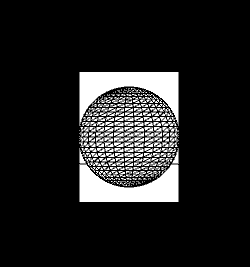
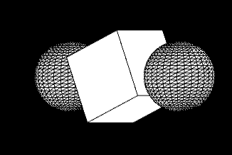

# Taller - Espacios Proyectivos y Matrices de Proyección
## Nombres: 
Jeronimo Bermudez Hernandez

Juan Felipe Fajardo Garzón

Juan David Buitrago Salazar

Juan David Cardenas Galvis

Nelson Ivan Castellanos Betancourt

Juan Pablo Correa Sierra


## Fecha de entrega: 27/02/2026

## Descripción breve: 


## Implementaciones: 

### Python (Jupyter)


### Unity:

### Three.js

### Processing:

En este entorno se desarrolló una escena sencilla con 3 objetos sobre el eje Z, donde se implementaron controles de traslación (flechas del teclado), y de rotación de la cámara (wasd), con el objetivo de simular la visión de una cámara, además de ello se hizo uso de perspective() y ortho() con el fin de ser más fiel a la proyección y vista que tiene una camara en un entorno 3D

## Resultados visuales:

### Python

### Unity:

### Three.js

### Processing:

En la siguiente imagen se presenta la vista de la cámara desde el eje z, se observa unicamente la proyección de los 2 elementos más cercanos a la cámara, la segunda esfera se encuentra oculta



En esta imagen se presenta la proyección desde una vista lateral  de los tres objetos, esta proyección se debe a la instrucción ortho(), puesto que esta cambia la vista en perspectiva a una proyección ortogonla, asimilandose más a una vista de cámara



También se puede tener una vista superior del objeto


## Código relevante: 

### Python

### Unity

### Three.js

### Processing

El siguiente código es el encargado de "configurar" la cámara dentro de processing, puesto que con perspective se pueden fijar parámetros como el field of view, el plano near y el plano rear
```java
float fov = PI/3.0;
  float cameraZ = (height/2.0) / tan(fov/2.0);
  perspective(fov, float(width)/float(height),cameraZ/10.0, cameraZ*10.0);
```

Luego tenemos el código encargado de aplicar las trasnformaciones a nuestros elementos, después de esa instrucción se tiene la creación de las esferas y el cubo.
Los parametros de posición y rotación se modifican haciendo uso de las teclas antes mencionadas

La instrucción ortho() sirve para cambiar la vista a proyección ortográfica
```java
background(0);
  
  ortho();
  pushMatrix();
  
  translate(xpos,ypos,zpos);
  rotateX(radians(xrot));
  rotateY(radians(yrot));
```

## Prompts utilizados: 


## Aprendizajes y dificultades: 

La principal dificultad del taller fue configurar los parámetros de perspectiva de la cámara, puesto que en algunos casos los planos quedaban mal y por ende los elementos nos se van a observar en la vista de cámara
  