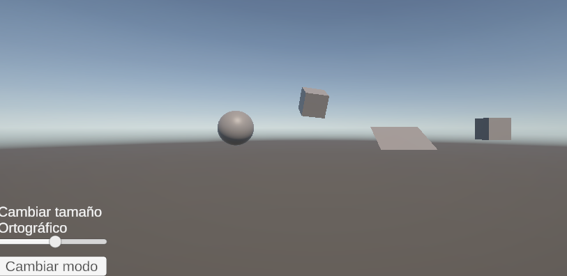
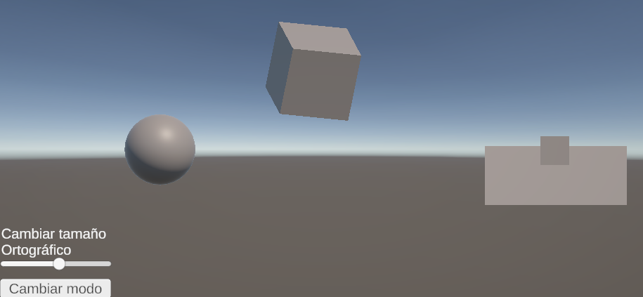

# Taller - Proyecciones 3D: Cómo ve una Cámara Virtual
## Nombres: 
Jeronimo Bermudez Hernandez

Juan Felipe Fajardo Garzón

Juan David Buitrago Salazar

Juan David Cardenas Galvis

Nelson Ivan Castellanos Betancourt

Juan Pablo Correa Sierra

## Fecha de entrega: 27/02/2026

## Descripción breve: 


## Implementaciones: 

### Unity:

Se desarrolló una escena simple con 2 cubos, una esfera y un plano inclinado, a esta se le añadió un script con el que se puede cambiar el modo de proyección para pasar de un modo de perspectiva a una proyección ortogonal, además, se implementó un slider con el fin de poder cambiar el tamaño del plano de proyección

### Three.js

## Resultados visuales:

### Unity:

En la siguiente imagen se observa la vista en perspecitiva de los objetos de la escena, se evidencia a simple vista la inclinación de los mismos, en especial la del plano, y parece que el cuadro de la derecha no se encuentra en el mismo eje que el plano inclinado



Sin embargo, al cambiar a proyección ortogonal la escena cambia totalmente



Debido a que el cubo más lejano es el de mayor tamaño, se ve como es el más grande en la proyección ortogonal; por otro lado, el cambio más visible es la vista del plano y el cubo de la derecha, estos al estar justo frente a la cámara su forma cambia a la de 2 cuadros 2D, y se ve como el cubo que antes no parecía al frente del plano ahora si lo está, evidenciando como la cámara vería los objetos desde el punto exacto donde está

### Three.js

## Código relevante: 


### Unity
La siguiente función se encarga de cambiar el modo de vista, evalua si se encuentra en perpectiva o proyección ortogonal y cambia el valor de la cámara por el otro; esta función se encuentra asociada al botón de la UI
```cs
void CambiarModo()
    {
        if (cam.orthographic)
        {
            cam.orthographic = false;
        }else
        {
            cam.orthographic = true;
        }
    }
```
De modo similar se tiene la función de cambiar el tamaño de la proyección otrogonal, esta recibe como parámeetro el valor del slider, luego evalua si se encuentra en modo de proyección ortogonal y finalmente ajusta el valor del atributo de la cámara
```cs
void CambiarTamano(float value)
    {
        if (cam.orthographic)
        {
            cam.orthographicSize = value;
        }
    }
```

### Three.js


## Prompts utilizados: 


## Aprendizajes y dificultades: 
La principal dificultad en Unity fue configurar el cambio de perspectivas correctamente, puesto que en algunos casos lanzaba un error relacionado con que el puntero se encontraba fuera del frustrum, lo cual se debía a problemas al inicializar la perspectiva ortogonal